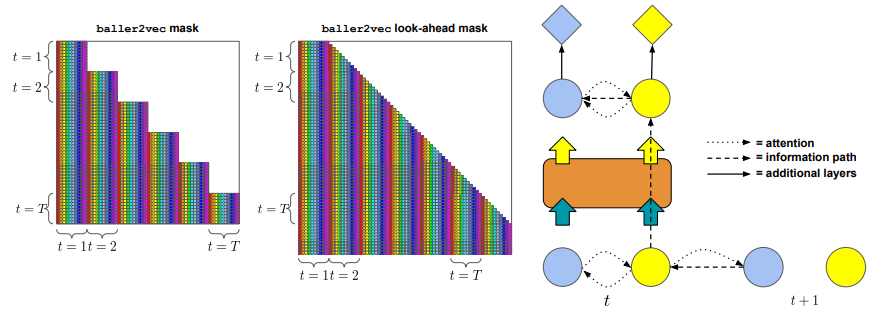
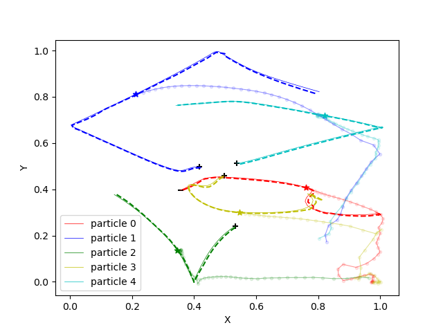

# Multi Agent Trajectory Prediction

## Introduction 
Multi-agent movement trajectory prediction is a research field focusing on forecasting the future paths of multiple interacting agents, such as vehicles, pedestrians, or robots. This area combines principles from machine learning, physics, and behavioral science to understand and predict complex dynamic systems. Accurate trajectory prediction is crucial for various applications, including autonomous driving, crowd management, and robotics, as it enhances safety, efficiency, and coordination.

## Related Works

In this direction two recent papers, i.e., *Baller2vec* and *Baller2vec++* have made significant progress. Baller2vec introduces a multi-entity generalization of the standard Transformer that can efficiently integrate information across entities and time with minimal assumptions. Building on this work, baller2vec++ incorporates a specially designed `self-attention mask` and "`look-ahead`" trajectory sequences to better model statistically dependent agent trajectories. 


A simple technique for learning to forecast statistically dependent agent trajectories is to modify the baller2vec self-attention mask such that it may "look ahead" at future positions of agents whose trajectories are created previous to the agent being processed in the current time step.

In *Rudolph et al.*, author presented a unique self-supervised technique for multiagent trajectories, and developed a masking strategy that makes masking of different trajectories independent of one another, as well as a unique transformer architecture that factorises over time and agents. This renders our pretraining model's encoder permutation equivariant with respect to trajectory order, making it ideal for downstream tasks that need *permutation invariance with respect to agent order*.

## Problem Formulation
> To systematically test the essence of `agent-ID` in multi-agent trajectory prediction and the permutation invariance with respect to their order.  

Hypothesis: The use of `agent-ID` would not help in terms of model performance in a deterministic movement environment. 

## Dataset
We considered a charged particle dataset that is used in *Kipf et al.*. We generated 50K training examples, and 10K validation and test examples for our experiments. The data is generated using a simulation code, which is also open sourced by the author [here](https://github.com/ethanfetaya/NRI/blob/e63fcb0144bca60eb1cffed9a94489de928d6c23/data/synthetic_sim.py#L143). 

The dataset has the dimension of `(N, time, agent, features)`,
where
1. `N`: No. of charged particles
2. `time`: time instances
3. `agent`: no. of charged particles
4. `features = 5`: data features, i.e., charge, X-coordinate, Y-coordinate, velocity-X-comp, velocity-Y-comp

## Methodology
The task described above we purpose a vanilla transformer encoder with the mask purposed in *Baller2Vec*. Eight transformer encoder layers were used to get the optimal result. The input and output side neural network (NN) would have 32,64,32 number of neurons respectively. The number of neurons at the end of these NN are same as `d_model` and `n_features-1` for input and output side of the encoder respectively. The model is trained for next step prediction.   

## Experiment Setup Instructions
Follow these steps to download the repository and set up the Conda environment using `environment.yml`.

### Step 1: Clone the Repository

First, clone the repository to your local machine using the following command:

```bash
git clone https://github.com/yourusername/your-repo-name.git
cd your-repo-name
```

### Step 2: Set Up Conda Environment
Ensure you have Conda installed on your system. If not, you can download it from [here](https://docs.anaconda.com/anaconda/install/), and create a new Conda environment using the provided `environment.yml` file:

```bash
conda env create -f environment.yml
conda activate agent
```

### Step 3: Data Generation

The dataset used for this research is inherited from the paper "*Neural Relational Inference for Interacting Systems*". It have a number of charged particles moving in a bounded area by intracting with other particles.

```bash
cd data/charged
python generate_dataset.py
cd ../
```

#### Arguments

- `--simulation` (type: `str`, default: `'charged'`): Specifies which simulation to generate.
- `--num-train` (type: `int`, default: `50000`): Specifies the number of training simulations to generate.
- `--num-valid` (type: `int`, default: `10000`): Specifies the number of validation simulations to generate.
- `--num-test` (type: `int`, default: `10000`): Specifies the number of test simulations to generate.
- `--length` (type: `int`, default: `5000`): Specifies the length of the trajectory.
- `--length-test` (type: `int`, default: `10000`): Specifies the length of the test set trajectory.
- `--sample-freq` (type: `int`, default: `100`): Specifies how often to sample the trajectory.
- `--n-balls` (type: `int`, default: `5`): Specifies the number of balls in the simulation.
- `--seed` (type: `int`, default: `42`): Specifies the random seed for reproducibility.

#### Usage Example

To run the script with custom arguments, use the following format:

```bash
python generate_simulation.py --simulation=gravity --num-train=60000 --num-valid=15000 --num-test=20000 --length=10000 --length-test=15000 --sample-freq=50 --n-balls=10 --seed=123
```

### Step 4: Model Training
Check `config.yml` file for configuration variables. These variables are described in the same file with their comments.

```bash
python train.py
```

#### Training Arguments

- `--data` (type: `str`, default: `'charge'`): Specifies the name of the dataset being used.

- `--model` (type: `str`, default: `'transformer'`): Specifies the name of the model being used.

- `--config-file` (type: `str`, default: `'config.yml'`): Specifies the configuration file to use.

- `--gpu` (type: `int`, default: `0`): Specifies the GPU id to use. The default is `0`.

- `--test-mode` (action: `store_true`): Runs the train file in code test mode when this flag is set. This argument does not require a value; it acts as a boolean switch. The training will run for a `single epoch` and `one encoder layer` will be used.

#### Usage Example

To run the script with custom arguments, use the following format:

```bash
python train.py --data="charge" --model="transformer" --config-file="config.yml" --gpu=1 --test-mode
```

### Step 5: Get Result
At the first run code will create a directory named as `results`. A typical result sub-directory would be as follows.

```bash
.
|-- expt-1| 2024-07-11 16:43
|    |-- config.yml # configuration file of the experiment.
|    |-- log.log # logger for training.
|    |-- loss.png # plot of loss value vs epochs.
|    |-- plots # contaion model prediction visualization of five randomly selected test data
|    |   |-- test-1.png
|    |   |-- test-2.png
|    |   |-- test-3.png
|    |   |-- test-4.png
|    |   `-- test-5.png
|    |-- summary.txt # contain information of model architecture and best loss value obtained. 
|    `-- weights # saved model parameters 
| ...

```

## Results
### Model Prediction Visualization


A sample prediction of the trained model, where 
- `solid (_)` lines indicate the actual particle trajectory 
- `dashed (--)` lines indicate single time step prediction by the model
- `bobbled-line (-.-)` indicate the multi-time step prediction of the model from the time instance marked with `*` on the actual particle trajectory. 
- `+/-` indicate charge on the particle

## References
- Kipf, Thomas, et al. "Neural relational inference for interacting systems." International conference on machine learning. PMLR, 2018.
- Alcorn, Michael A., and Anh Nguyen. "baller2vec: A multi-entity transformer for multi-agent spatiotemporal modeling." arXiv preprint arXiv:2102.03291 (2021).
- Alcorn, Michael A., and Anh Nguyen. "baller2vec++: A look-ahead multi-entity transformer for modeling coordinated agents." arXiv preprint arXiv:2104.11980 (2021).
- Dufter, Philipp, Martin Schmitt, and Hinrich Schütze. "Position information in transformers: An overview." Computational Linguistics 48.3 (2022): 733-763.
- Rudolph, Yannick, and Ulf Brefeld. "Masked Autoencoder Pretraining for Event Classification in Elite Soccer." International Workshop on Machine Learning and Data Mining for Sports Analytics. Cham: Springer Nature Switzerland, 2023.